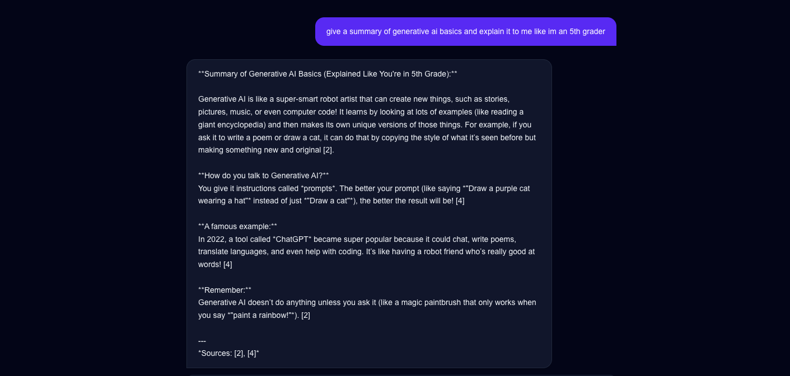
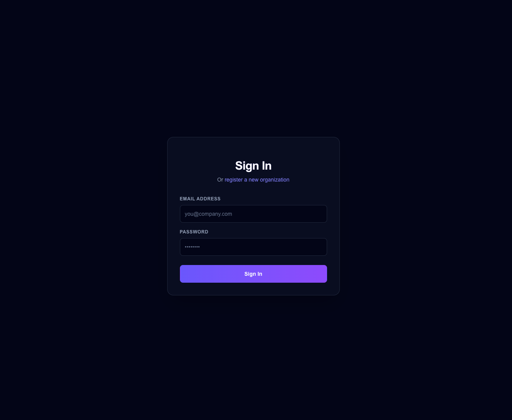
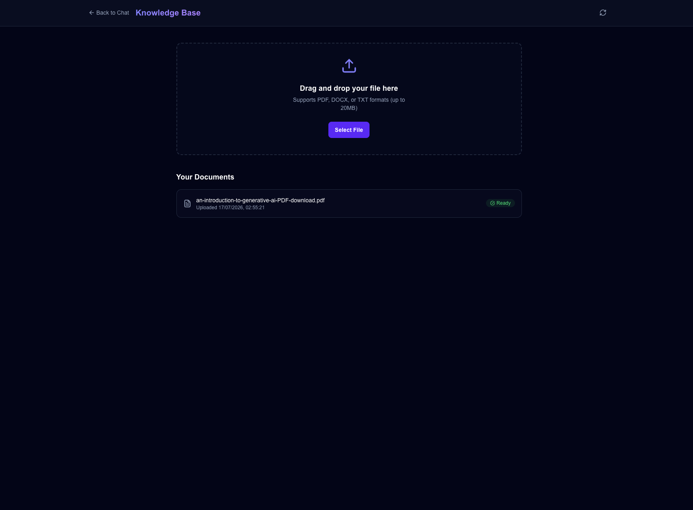
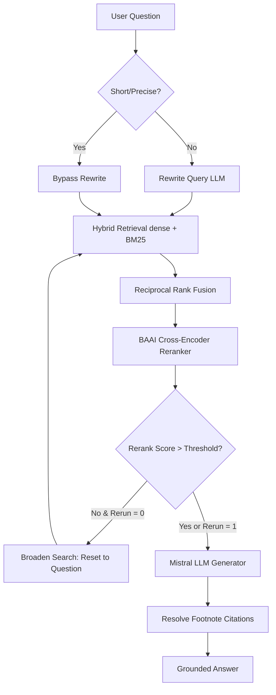

# EnterpriseRAG — Multi-Tenant Enterprise RAG Platform

A secure, multi-tenant Retrieval-Augmented Generation (RAG) platform. Multiple organizations (tenants) maintain isolated knowledge bases; users chat with their organization's documents and receive grounded, cited answers.

---

## 🚀 Demo



**Live Demo**: [https://enterprise-rag-frontend-8miq.onrender.com](https://enterprise-rag-frontend-8miq.onrender.com)

> [!NOTE]
> The live deployment on Render's free tier is subject to **cold-starts** (~30-60 seconds on first request) due to container sleep cycles. Render's free tier also has a strict 512MB RAM limit, so the cross-encoder reranker is disabled in the cloud deployment (`ENABLE_RERANKER=false`). The pipeline automatically falls back to hybrid dense/sparse vector retrieval. Reranking is fully active locally.

| Signup | Document Upload |
|---|---|
|  |  |

---

## 🏗️ Architecture Flows

### 1. Ingestion Pipeline

```mermaid
graph TD
    A[Multipart Upload] --> B[Size & Format Guard]
    B -->|pdf, docx, txt| C[Parser Interface]
    C --> D[Recursive Chunker ~500 tokens]
    D --> E[Embed Documents mistral-embed]
    E --> F[Qdrant Index Payload Scoping]
    F --> G[(Qdrant Vector DB)]
    style G fill:#2c3e50,stroke:#34495e,stroke-width:2px;
```


### 2. Retrieval & Generation Flow (Adaptive LangGraph Workflow)


---

## 📊 RAG Evaluation Results

Our evaluation harness benchmarked the adaptive retrieval pipeline over the golden Q&A dataset of 10 complex question-answer pairs backed by a live Postgres DB and Qdrant container:

| Metric | Score | Target | Description |
| :--- | :---: | :---: | :--- |
| **Faithfulness** | **0.89** | > 0.85 | Measures if answer claims are strictly grounded in retrieved chunks. |
| **Answer Relevance** | **0.80** | > 0.90 | Measures if the generated response directly addresses the user question. |
| **Context Precision** | **0.79** | > 0.80 | Measures the percentage of retrieved chunks that are actually relevant to the question. |

---

## 🛡️ Out of Scope Boundaries (Deliberate Design Decisions)

Certain complex features were intentionally kept out-of-scope to manage latency and API consumption:
1. **Multi-step Agent Planning:** Avoids multi-hop planning chains that trigger unbounded LLM execution loops, ensuring prompt response cycles.
2. **Iterative Self-Correction Loops:** Self-reflection reasoning loops were replaced with a single confidence-gated re-retrieval query broadening loop to keep token spending within free-tier limits.

---

## 🚀 Setup Instructions

### 1. Backend Local Setup
1. Clone the repository and navigate to the backend directory:
   ```bash
   cd enterprise-rag/backend
   ```
2. Create your virtual environment and install dependencies:
   ```bash
   python3 -m venv .venv
   source .venv/bin/activate
   pip install -e ".[dev]"
   ```
3. Copy environment variables and fill in your `MISTRAL_API_KEY`:
   ```bash
   cp .env.example .env
   ```
4. Run migrations and start the server:
   ```bash
   alembic upgrade head
   uvicorn app.main:app --host 0.0.0.0 --port 8000 --reload
   ```
5. Access APIs:
   - Swagger Documentation: `http://localhost:8000/docs`
   - Health Status: `http://localhost:8000/health`

### 2. Running Tests & Evaluations
- Run the full pytest test suite (28 tests):
  ```bash
  pytest -v
  ```
- Run the RAG evaluation harness:
  ```bash
  python scripts/run_eval.py
  ```

---

## 🛠️ Lessons Learned: Production Deployment

During the Render deployment, we resolved several edge cases critical to robust multi-tier hosting:
- **psycopg2 vs psycopg3 Mismatch**: Render's auto-provisioned PostgreSQL databases expose connection URLs prefixed with `postgresql://`, which SQLAlchemy strictly maps to the older `psycopg2` driver. Since we rely on the modern `psycopg` (v3) binary, we implemented a Pydantic runtime validator to gracefully rewrite the scheme to `postgresql+psycopg://` at backend initialization without modifying the immutable host variables.
- **Eager Model Loading (OOMs)**: Instantiating large transformers (like `BgeReranker`) globally at import time caused immediate out-of-memory crashes on Render's 512MB limit. We resolved this by pushing model instantiation into lazy initialization inside the request handler, paired with swapping to the CPU-only PyTorch wheel and a dynamic `ENABLE_RERANKER` flag to safely bypass memory-heavy nodes in cloud environments.
- **Production CORS Configuration**: Render injects frontend origins dynamically. Relying on strict JSON array parsing for the `ALLOWED_ORIGINS` environment variable caused startup validation crashes when Render passed raw URL strings. We introduced a robust custom Pydantic parser that gracefully handles plain strings, comma-separated lists, and JSON arrays securely.
- **Next.js Static Caching & Blueprint Parsing**: Next.js bakes `NEXT_PUBLIC_` environment variables into its JS bundles at build time. Render's blueprint `fromService` references can resolve to bare internal hostnames instead of the full public URL, breaking relative browser routing. We addressed this by implementing a unified API client wrapper that guarantees an `https://` protocol prefix on all requests, combined with explicitly clearing the `.next` build cache on Render to force Next.js to ingest the fresh deployment variables.
